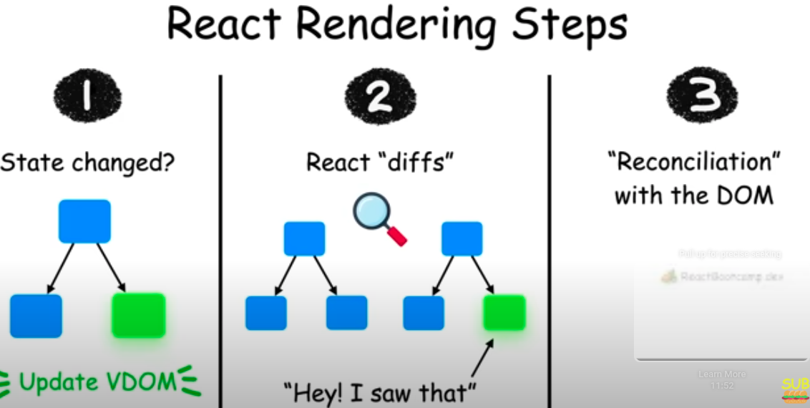

# React

# Describing the UI

## JSX

- JSX is different from HTML: In JSX, we can write JavaScript expressions inside curly braces {}.
- Example: `<h1>Hello, {name}</h1>`
- Components are the building blocks of a React application: They are just JavaScript functions (or classes) and their names must start with an uppercase letter.
- Console logging in development: When using React.StrictMode, components may render twice in development mode to help detect potential issues. This does not happen in production builds.

## React Rendering Steps

- State Change Occurs - A component's state or props are updated.
- Virtual DOM Update - React detects the change and creates a new Virtual DOM tree.
- Diffing Algorithm Runs - React compares the new Virtual DOM with the previous one to identify changes (DOM diffing).
- Reconciliation and DOM Update - React updates only the parts of the actual DOM that changed, ensuring efficient rendering.



## Styling

- use 3 main ways

```javascript
# 1. Inline Styles

//use the style prop
//The value is a JavaScript object, not a string.
//no support for pseudo-classes (like :hover) or media queries
<button style={{ backgroundColor: 'blue', color: 'white' }}>

# 2. CSS Stylesheets
import './styles.css';

function Button() {
  return <button className="btn">Click Me</button>;
}

# 3. CSS Modules

//Scoped CSS: styles are locally scoped to the component.
//Filename ends with .module.css. -> Button.module.css
//Good for: component-based architecture; avoids style conflicts

import styles from './Button.module.css';

function Button() {
  return <button className={styles.btn}>Click Me</button>;
}
```

## Props

- Props are parameters passed to components. They allow data to flow from parent to child components.
- Example: `<Welcome name="John" />`
- Props are immutable: You cannot modify props directly inside a component. If you need to change data, use state instead.
- When you place content within a JSX tag, the parent component automatically receives that content as a `children` prop. For instance, in the example below, the **Card** component receives the **children** prop containing ****`<Avatar />`**** and renders it inside a wrapper **div**.

    ```javascript
    function Card({ myProp, children }) {
      return (
        <div className="card">
          {children}
        </div>
      );
    }
    
    export default function Profile() {
      return ( <Card myProp={...}>  <Avatar/>  </Card> );
    }
    ```

## React Fragments

- Fragments (<>...</>) let you group multiple JSX elements without adding extra nodes to the DOM. Unlike wrapping with a `<div>`, fragments do not produce any HTML tags in the final output.

## Rendering a List

- When using JSX elements directly inside a `map()` call, you must always assign them unique **keys**. Keys help React identify and manage elements efficiently. Keep in mind: 
- **Keys must be unique among siblings.**  
- **Keys should remain stable and not change over time.**  
- **Avoid generating keys dynamically during rendering.**

## Keeping Components Pure

- In general, you should not rely on components being rendered in any specific order.  

- **Avoid side effects caused by shared state:** If a component reads and writes to a shared variable (e.g., a `guest` variable declared outside the component), rendering it multiple times may lead to inconsistent JSX.  
- **Unpredictable behavior:** Other components that access the same shared variable will produce different JSX depending on when they are rendered. This lack of predictability can lead to bugs and unintended behavior.

    ```javascript
    #Bad
    let guest = 0;    
    function Cup() {
      guest = guest + 1;// Bad: changing a preexisting variable!
      return <h2>Tea cup for guest #{guest}</h2>;
    }
    
    export default function TeaSet() {
      return (
        <>
          <Cup /><Cup /><Cup />
        </>
      );
    }
    
    #Good
    function Cup({ guest }) {
      return <h2>Tea cup for guest #{guest}</h2>;
    }
    
    export default function TeaSet() {
      return (
        <>
          <Cup guest={1} /><Cup guest={2} /><Cup guest={3} />
        </>
      );
    }
    ```

# Adding Interactivity

## Responding to Events

- Functions passed to event handlers must be passed, not called. For example:
    ```javascript
    <button onClick={handleClick}> //passing a function (correct)
    <button onClick={handleClick()}>//calling a function (incorrect)
    ``` 
- This tells React to remember it and only call your function when the user clicks the button.
- In the second example, the () at the end of handleClick() fires the function immediately during rendering, without any clicks
    ```javascript
    <button onClick={() => alert('...')}> //passing a function (correct)
    <button onClick={alert('...')}> //calling a function (incorrect)
    ```
- In both cases, what you want to pass is a function:

- Because event handlers are declared inside of a component, they have access to the component’s props.

- All events propagate in React except onScroll, which only works on the JSX tag you attach it to.
    ```javascript
    export default function Toolbar() {
      const handleClick = () => {
          alert('You clicked on the toolbar!');
      };
      
      return (
        <div className="Toolbar" onClick={handleClick}>
          <button onClick={() => alert('Playing!')}>
            Play Movie
          </button>
          <button onClick={(e) => {
                e.stopPropagation();
                alert('Uploading!') }
          }> Upload Image with no propagation/bubbling</button>    
        </div>
      );
    }
    ```

## A Component’s Memory and State in React

- State works like a snapshot, so you can’t read the latest state from an asynchronous operation like a timeout.

1. **State vs. Local Variables**:

   * **State** retains information between renders, while local variables reset each time a component re*renders.
   * **State updates trigger re*renders**, whereas changes to local variables do not.

2. **Understanding State**:

   * State is private to a component and cannot be changed by parent components.
   * Use **useState** to declare and manage state in a functional component.
   * State updates are asynchronous and processed after event handlers complete (called **batching**).
   * This means React waits until the current event handler or lifecycle method finishes before processing state changes, improving performance by minimizing re-renders.

```javascript
const [text, setText] = useState("");

const handleClick = () => {
  setText("ddd");
  console.log(text); // 👀
};
//setText("ddd") schedules the state update — it does not immediately update text.
//console.log(text) will still print the old value (before the update), not "ddd".
// React batches state updates during event handlers to optimize performance. It applies all state changes after the handler finishes — //so text hasn't changed yet at the time of the console.log.
```

4. **How React Handles Renders**:

   * React calls the component function, which returns a JSX snapshot based on the state (at that time).
   * React updates the UI to match this snapshot.
   * State remains fixed during a render; updates apply only in the next render.

5. **Managing Multiple State Updates**:

   * Calling **setState** multiple times with the same value may not behave as expected due to state snapshots.
   * Use **updater functions** (e.g., **setNumber(n => n + 1)**) to ensure updates are based on the latest state.

        ```javascript
        <button onClick={() => {
          setNumber(number + 1);
          setNumber(number + 1);
          setNumber(number + 1);}}>+3</button>
        //In each function React prepares to change number to 1 on the next render since initial value is 0
        //Its value was “fixed” when React “took the snapshot” of the UI by calling your component.
        ```
     * To summarize, here’s how you can think of what you’re passing to the setNumber state setter:
        1. An updater function (**e.g. n => n + 1**) gets added to the queue.
        2. Any other value (**e.g. number 5**) adds “replace with 5” to the queue, ignoring what’s already queued.

6. **Updating Objects and Arrays in State**:

   * State objects and arrays should be treated as **immutable**. Do not modify them directly; instead, create a copy and update it.
   * Example for objects:
     ```javascript
     setPerson({
       ...person,
       firstName: e.target.value,
     });
     ```
   * Example for arrays:
     ```javascript
     setArtists([
       ...artists,
       { id: nextId++, name: name },
     ]);
     ```

7. **Key Patterns for State Management**:

   * **Objects**: Use the spread operator (**...**) to copy and update fields.
   * **Arrays**: Use array methods like **map**, **filter**, or **slice** to create a new array and apply changes (e.g., adding, removing, or transforming items).

8. **Best Practices**:

   * Keep state values immutable to ensure React re*renders correctly.
   * Use updater functions for sequential updates in event handlers.
   * Avoid defining hooks inside conditional blocks or nested functions.

- State Triggers Re-Renders: Calling a state updater function like setState() doesn't immediately change the state variable. Instead, it schedules a re-render, during which React provides the updated state. ​

- State is External to Components: State is maintained by React outside of your component functions. When React re-renders a component, it passes the current state snapshot to the function.

- Event handlers use the state from when they were created.
- If you update the state more than once inside the same event (like a button click), all those updates use the same "old" version of the state — not the updated one.
  
# Managing State

### Best Practices for Managing State in React

### Declarative UI

- Describe what the UI should look like for each state, not how to update it (declarative > imperative).
- Declarative programming means describing the UI for each visual state rather than micromanaging the UI (imperative).

### State Design Principles

- **Merge related state**: If two state variables always change together, combine them.
- **Avoid impossible states**: Choose state structure that naturally prevents invalid combinations.
- **Reduce mistakes**: Keep state minimal and avoid redundancy.
- **Don’t mirror props** in state unless intentionally preventing updates.

- For selections, store IDs/indexes instead of whole objects.
- Flatten deeply nested state for easier updates.

### Lifting State Up

- When two components need shared state:
  1. Move the state to their **common parent**.
  2. Pass data and event handlers down via **props**.
- This approach ensures synchronization and separation of concerns.

### Component Identity and State Preservation

- React tracks components by **position in the UI tree**, not by their JSX tag.
* **Same component at the same position** = state preserved
* **Different component or position** = state reset

- To preserve state across renders:
  - Keep tree structure consistent.
  - Declare components at the **top level** (don’t nest function components).
  - Use `key` to differentiate components explicitly if needed.

### Resetting state at the same position
There are two ways to reset state when switching between them:

1. Render components in different positions
2. Give each component an explicit identity with key
**NOTE:** Remember that keys are not globally unique. They only specify the position within the parent.

## Extracting State Logic into a Reducer

### Why Use a Reducer?

- As components grow, using multiple `useState` hooks can make state management messy. A **reducer** centralizes all state logic in a single pure function, improving clarity, maintainability, and debuggability.

**Key Points:**

**Reducers must be pure:** No side effects—just compute and return the new state based on current state + action.

**Actions reflect user interactions:** One action should represent one meaningful interaction (e.g., reset_form instead of multiple set_fields).

**Better for complex state:** Especially when state updates are spread across many handlers.

**Steps to convert** useState to useReducer:
1. Dispatch actions from handlers.
2. Write a pure reducer function.
3. Replace useState with useReducer.
👉 Use Immer if you prefer writing reducers in a mutating style but want to preserve immutability.

```js
# From
const [tasks, setTasks] = useState(initialTasks);

function handleAddTask(text) {
  setTasks([
    ...tasks, {id: nextId++,text: text, done: false, },
  ]);
}

# To
import tasksReducer from "./reducer";
const [tasks, dispatch] = useReducer(tasksReducer, initialTasks);

function handleAddTask(text) {
  dispatch({type: 'added', id: nextId++,text: text,});
}

// when dispatch is called, the reducer function is called with the current state and the action
// the reducer function returns the new state


// In reducer

// reducer function should take two arguments, the current state and the action

function tasksReducer(tasks, action) {
  if (action.type === 'added') {
    return [...tasks, {id: action.id,text: action.text,done: false,},
    ];
  } else if (action.type === 'changed') {
    ...
  }
}

//If reducer function is in the same file, then it should be declared before the useReducer hook
```

## Passing Data Deeply with Context

- Context lets a component provide some information to the entire tree below it.
- This helps avoid "prop drilling," where props are passed through intermediate components that do not need them.​
- To pass context:

  1. Create and export it with `export const MyContext = createContext(defaultValue)`.
  2. Pass it to the `useContext(MyContext)` Hook to read it in any child component, no matter how deep.
  3. Wrap children into `<MyContext value={...}>` to provide it from a parent.

- Context passes through any components in the middle.
- Context lets you write components that “adapt to their surroundings”.
- Before you use context, try passing props or passing JSX as `children`.

### When to Use Context

- When multiple components need access to the same data.
- To avoid passing props through many layers of components.
- For global settings like themes, user authentication, or localization.​

### Example

- Suppose you have a `Section` component that sets the heading level, and a `Heading` component that renders a heading based on the current level:​

```javascript
#Example 1

#STEP 1
#create a context with initial/default value/s

//LevelContext.js
import { createContext } from 'react';
export const LevelContext = createContext(0);

#STEP 2
#Provide Context to a Subtree
#Wrap part of the component tree with the `LevelContext.Provider`, and pass the context value.
#accept value/s as props, so in the place that this file is used can pass the value/s

//Section.js
import { useContext } from 'react';
import { LevelContext } from './LevelContext.js';

function Section({ level, children }) {
  return (
    <LevelContext.Provider value={level}>
      {children}
    </LevelContext.Provider>
  );
}

#STEP 3
#Consume Context with `useContext`
#Use `useContext()` to read the current value of the context.

//Heading.js
import { useContext } from 'react';
import { LevelContext } from './LevelContext.js';

function Heading({ children }) {
  const level = useContext(LevelContext);
  const Tag = `h${level}`;
  return <Tag>{children}</Tag>;
}

#STEP 4
#Compose Nested Components
#You can now use `Section` and `Heading` components to build a dynamic heading structure:

<Section level={1}>
	<Heading>Heading 1</Heading>

	<Section level={2}>
		<Heading>Heading 2</Heading>

		<Section level={3}>
			<Heading>Heading 3</Heading>
        </Section>
    </Section>
</Section>

#Example 2

//UserContext.ts
interface UserContextType {
  userName: string;
  setUserName: (name: string) => void;
}

const UserContext = createContext<UserContextType | null>(null);
export default UserContext;

//Wrapper.tsx
const [userName, setUserName] = useState<string>("some initial value");

<UserContext.Provider value={{ userName, setUserName }}>	
	<Parent />
</UserContext.Provider>


//Parent.tsx
<div>
	<Child1 />
    <Child2 />
</div>

//Child1.tsx
const context = useContext(UserContext);
if (!context) {	throw new Error("Error");}
const { userName } = context;

<div>
    <>{userName}</>
</div>

//Child2.tsx
const context = useContext(UserContext);
if (!context) {	throw new Error("Error");}
const { userName, setUserName } = context;

<div>
	<input
		type="text"
		value={userName}
		onChange={(e) => setUserName(e.target.value)}
		placeholder="Enter your name"
	/>
</div>
```


## Scaling Up with Reducer and Context

- You can combine **`useReducer`** with **React Context** to manage more complex state logic across your component tree.

- Instead of passing individual event handler functions from the context provider, you can pass a `dispatch` function returned by `useReducer()`. This allows deeply nested components to trigger state updates by dispatching actions—making your state management more scalable and maintainable.

```javascript
const initialState = {};
const [state, dispatch] = useReducer(reducerFunction, initialState);

<UserContext.Provider value={{ ...state, dispatch }}>
  <Parent />
</UserContext.Provider>
```

This approach is especially useful when:
- Your state has multiple properties.
- You want to centralize your update logic.
- You’re managing actions like login/logout, form updates, etc.

# React Routers

```javascript
npm install react-router-dom

//In App.tsx
import { BrowserRouter, Routes, Route } from "react-router-dom";
<BrowserRouter>
	<Nav /> //Nav should be rendered under BrowserRouter

	<Routes>
		<Route path="/" element={<Home />} />
		<Route path="/about" element={<About />} />

    	// Nested routes
		<Route path="/dashboard" element={<Dashboard />}>
			<Route path="settings" element={<Settings />} /> //no forward slash before route
			<Route path="profile" element={<Profile />} />
		</Route>

    	// Dynamic routes
    	<Route path="/product/:id" element={<About />} />    
	</Routes>
</BrowserRouter>

//Nav.tsx
<>
	<Link to="/">Home</Link>
	<Link to="/dashboard">Dashboard</Link>
	<Link to="/about">About</Link>
</>

//Dashboard.tsx
<>
	<Link to="settings">Settings</Link> //no forward slash before route
	<Link to="profile">Profile</Link>
	<Outlet /> //This component needs to be there to render the nested route component properly
</>

//To access the dynamic route params use const {id} = useParams();

//Progamitic navigation

const navigate = useNavigate();
const onclickHandler = ()=>{
    navigate("/home",{state:{someState}})
}

<button onClick={onclickHandler}>navigate to homepage</button>

//To access the passing state from the component
const location = useLocation();
const {someState} = location.state || {}
```

# Escape Hatches

## Referencing values with refs 

- When you want a component to “remember” some information, but you don’t want that information to trigger new renders, you can use a ref:
- ref is a plain JavaScript object with the current property that you can read and modify.
- You can access the current value of that ref through the ref.current property.

```javascript
import { useRef } from 'react';
let ref = useRef(0);
```
**When to use refs:**  
Use refs when your component needs to interact with external APIs (like browser APIs) without affecting rendering. Common cases include:
- Storing timeout IDs  
- Accessing or manipulating DOM elements  
- Holding non-JSX-related objects
If the value doesn’t affect rendering, use a ref.
**Avoid using `ref.current` during rendering:**  
- Don’t read or write `ref.current` while rendering. If you need data during rendering, use state instead. React doesn’t track changes to refs, so using them in render can lead to unpredictable behavior.

## Manipulating the DOM with Refs

### Getting a ref to the node 

```javascript
const myRef = useRef(null);
<div ref={myRef}> //This tells React to put this <div>’s DOM node into myRef.current.
//You can then access this DOM node from your event handlers and use the built-in browser APIs defined on it.
myRef.current.scrollIntoView();
```

- Usually, you will use refs for non-destructive actions like focusing, scrolling, or measuring DOM elements.
- You can pass refs from parent component to child components just like any other prop.
- So can access another component’s DOM nodes, and it can make your code fragile.
- Avoid changing DOM nodes managed by React.
- You can safely modify parts of the DOM that React has no reason to update.

## Synchronizing with Effects

- Unlike events, Effects are caused by rendering itself rather than a particular interaction.
- Effects let you synchronize a component with some external system (third-party API, network, etc).
- Effects let you run some code after rendering so that you can synchronize your component with some system outside of React.
- By default, Effects run after every render (including the initial one).
- React will skip the Effect if all of its dependencies have the same values as during the last render.
- You can’t “choose” your dependencies. They are determined by the code inside the Effect.
- Empty dependency array ([]) corresponds to the component “mounting”, i.e. being added to the screen.
- In Strict Mode, React mounts components twice (in development only!) to stress-test your Effects.
- in development React remounts every component once immediately after its initial mount.
- This is the correct behavior in development. By remounting your component, React verifies that navigating away and back would not break your code.
- Remounting components only happens in development to help you find Effects that need cleanup.
- You can turn off Strict Mode to opt out of the development behavior, but we recommend keeping it on.
- This illustrates that if remounting breaks the logic of your application, this usually uncovers existing bugs. (ex: call buy procut API in an effect is wrong)
- If your Effect breaks because of remounting, you need to implement a cleanup function.
- React will call your cleanup function before the Effect runs next time, and during the unmount.

Example:

```javascript
useEffect(() => {
  // This runs after every render
});

useEffect(() => {
  // This runs only on mount (when the component appears)
}, []);

useEffect(() => {
  // This runs on mount *and also* if either a or b have changed since the last render
}, [a, b]);
```

```javascript
//Some APIs may not allow you to call them twice in a row. For example, the showModal method of the built-in <dialog> element throws if you call it twice. Implement the cleanup function and make it close the dialog:

useEffect(() => {
  const dialog = dialogRef.current;
  dialog.showModal();
  return () => dialog.close();
}, []);

//In development, your Effect will call showModal(), then immediately close(), and then showModal() again. This has the same user-visible behavior as calling showModal() once, as you would see in production.
```

## You Might Not Need an Effect

- useEffect is intended for synchronizing your component with external systems (like browser APIs, network requests, or third-party libraries). If you're not interacting with such systems, you likely don't need useEffect.
- If you can calculate something during render, you don’t need an Effect.
- To cache expensive calculations, add useMemo instead of useEffect.
- To reset the state of an entire component tree, pass a different key to it.
- To reset a particular bit of state in response to a prop change, set it during rendering.
- Code that runs because a component was displayed should be in Effects, the rest should be in events.
- If you need to update the state of several components, it’s better to do it during a single event.
- Whenever you try to synchronize state variables in different components, consider lifting state up.
- You can fetch data with Effects, but you need to implement cleanup to avoid race conditions.
- When you give each component a different key, React knows they are not the same and keeps their data separate.
- Assigning a unique key to a component instance tells React to fully unmount and remount it when the key changes, preventing shared state and ensuring a fresh internal lifecycle for each instance.
- When you’re not sure whether some code should be in an Effect or in an event handler, ask yourself why this code needs to run. Use Effects only for code that should run because the component was displayed to the user

### useMemo

🔹 What is useMemo?
- useMemo is a React Hook that memoizes the result of a function — it saves the result and only recalculates it when its dependencies change.

🔹 Why use it?
- To optimize performance by avoiding expensive recalculations or re-renders of components when the inputs haven't changed.

```javascript
//How to use it?
const memoizedValue = useMemo(() => computeExpensiveValue(a, b), [a, b]);
//The function runs only when a or b changes.
//React skips recalculating if dependencies are the same as the last render.
```
🔹 When to use it?
- For expensive calculations (e.g., filtering, sorting large lists).
- When passing stable values to child components to avoid unnecessary re-renders.
- Only when there's a real performance issue — don’t overuse it.

### Race Condition in useEffect

- A race condition happens when multiple async operations (like API calls) overlap, and a slower one finishes after a newer one, causing outdated data to be used.

```javascript
useEffect(() => {
  fetchData().then(setData);
}, [query]);
//If query changes quickly, older fetchData() results might overwrite the newer ones.

#Solution :  Use AbortController or a flag Or use a flag to ignore outdated responses.

useEffect(() => {
  const controller = new AbortController();
  fetchData({ signal: controller.signal }).then(setData).catch(() => {});

  return () => controller.abort(); // cancels previous request
}, [query]);
```

### When You Do Need useEffect

- Use useEffect when you need to synchronize with external systems, such as:
- Subscribing to a data stream or event listener.
- Fetching data from an API when the component mounts.
- Manually manipulating the DOM (e.g., focusing an input).

## Lifecycle of Reactive Effects

- Each Effect in your code should represent a separate and independent synchronization process.
- **Effects re-synchronize based on the dependency array**.
  If your Effect contains logic that **doesn't need to re-synchronize** when a dependency changes, it's better to **move that logic outside** the Effect. Mixing unrelated concerns can lead to incorrect behavior or unnecessary updates.

- **Props, state, and all variables declared inside the component body are reactive**.
  These values are recalculated during each render and participate in React's data flow.

- **Reactive values must be included in the dependency array**.
  This includes not only props and state but also **any values derived from them**.

- From the **Effect’s perspective**, you don't need to think in terms of "mount" and "unmount."
  Instead, focus on **what the Effect does to start and stop synchronization**. React will handle cleanup automatically when needed.

- Any **variable from the component body** that is used inside an Effect should be in its **dependency list**, to ensure the Effect stays in sync with the latest values.

```javascript
function ChatRoom({ roomId, selectedServerUrl }) { // roomId is reactive
  const settings = useContext(SettingsContext); // settings is reactive
  const serverUrl = selectedServerUrl ?? settings.defaultServerUrl; // serverUrl is reactive
  useEffect(() => {
    const connection = createConnection(serverUrl, roomId); // Your Effect reads roomId and serverUrl
    connection.connect();
    return () => {
      connection.disconnect();
    };
  }, [roomId, serverUrl]); // So it needs to re-synchronize when either of them changes!
  // ...
}
```
- Effects are not a tool for code reuse.
- Components can mount, update, and unmount.
- Each Effect has a separate lifecycle from the surrounding component.
- Each Effect describes a separate synchronization process that can start and stop.
- When you write and read Effects, think from each individual Effect’s perspective (how to start and stop synchronization) rather than from the component’s perspective (how it mounts, updates, or unmounts).
- Values declared inside the component body are “reactive”. Or you could say Props, state, and variables declared inside your component’s body are called reactive values
- Reactive values should re-synchronize the Effect because they can change over time.
- The linter verifies that all reactive values used inside the Effect are specified as dependencies.
- All errors flagged by the linter are legitimate. There’s always a way to fix the code to not break the rules.

## Separating Events from Effects

- Event handlers run in response to specific interactions.
- Effects run whenever synchronization is needed.
- Logic inside event handlers is not reactive.
- Logic inside Effects is reactive.
- You can move non-reactive logic from Effects into Effect Events.
- Only call Effect Events from inside Effects.
- Don’t pass Effect Events to other components or Hooks.
- You should only extract Effect Events for a specific reason: when you want to make a part of your code non-reactive. 

```javascript
#Note: This is an experiment tool yet

import { useState, useEffect } from 'react';
import { experimental_useEffectEvent as useEffectEvent } from 'react';

export default function Timer() {
  const [count, setCount] = useState(0);
  const [increment, setIncrement] = useState(1);

  const ontick = useEffectEvent(()=>{
    setCount(c => c + increment);
  });

  useEffect(() => {
    const id = setInterval(() => {
      ontick()
    }, 1000);
    return () => {
      clearInterval(id);
    };
  }, []);
//if you put `increment` in the dependence arry, every change to increment causes the Effect to re-synchronize,
//which causes the interval to clear. If you keep 
//clearing the interval every time before it has a chance to fire, it will appear as if the timer has stalled.

  return (
    <>
      <h1>
        Counter: {count}
        <button onClick={() => setCount(0)}>Reset</button>
      </h1>
      <hr />
      <p>
        Every second, increment by:
        <button disabled={increment === 0} onClick={() => {
          setIncrement(i => i - 1);
        }}>–</button>
        <b>{increment}</b>
        <button onClick={() => {
          setIncrement(i => i + 1);
        }}>+</button>
      </p>
    </>
  );
}
```

## Removing Effect Dependencies

### Core Principle

**Dependencies should always match the code**

- when you're not happy with your dependencies, edit the code, not the dependency array.

### Key Questions to Ask Before Fixing Dependencies

Before adjusting dependencies, evaluate your Effect by asking these critical questions:

**Should this code move to an event handler?**

- If code should run in response to specific user interactions, move it to an event handler instead of an Effect

**Is your Effect doing several unrelated things?**

- Each Effect should represent one independent synchronization process
- Split complex Effects into multiple focused Effects if they handle different concerns

**Are you reading state to calculate the next state?**

- Use updater functions instead of reading current state as a dependency
- Pass `setState(prev => prev + 1)` rather than `setState(count + 1)`

**Do you want to read a value without "reacting" to its changes?**

- Extract an Effect Event when you need to access current values without triggering re-runs
- Use Effect Events for reading latest values without making them dependencies

**Does some reactive value change unintentionally?**

- Objects and functions recreated on every render cause unnecessary re-synchronizations
- This is the most common cause of excessive Effect re-runs

### The Object and Function Problem

**Why Objects and Functions Cause Issues:**

- In JavaScript, each newly created object/function is considered distinct from all others
- Content doesn't matter - `{}` !== `{}` and `() => {}` !== `() => {}`
- Components recreate objects/functions on every render, triggering Effects unnecessarily

**Impact on Performance:**

- Effect re-synchronizes more often than needed
- Can cause performance issues and infinite loops
- Makes debugging more difficult

### Solutions for Different Scenarios

**Move Code to Event Handlers:**

- Use when code should respond to specific interactions
- Event handlers don't need dependency arrays
- Better separation of concerns

**Split Effects:**

- Separate unrelated synchronization logic
- Each Effect handles one specific concern
- Easier to debug and maintain

**Use Updater Functions:**

- Replace `setState(count + 1)` with `setState(prev => prev + 1)`
- Removes state variables from dependencies
- Prevents stale closure issues

**Extract Effect Events:**

- Access latest values without making them dependencies
- Useful for reading props/state without triggering re-runs
- Maintains access to current values while avoiding re-synchronization

**Restructure Object/Function Dependencies:**

- **Move outside component:** Define constants outside component scope
- **Move inside Effect:** Create objects/functions within the Effect body
- **Extract primitive values:** Use only the specific primitive values you need
- **Use primitive props:** Structure component APIs around primitives when possible

### Best Practices

**Avoid Suppressing the Linter:**

- Never ignore dependency warnings without proper justification
- Suppressing leads to confusing bugs and stale closures
- Always "prove" to the linter that a dependency isn't necessary

**Prefer Primitive Dependencies:**

- Use strings, numbers, booleans instead of objects when possible
- Primitive values are compared by value, not reference
- Makes components easier to optimize later

**Structure for Success:**

- Design component APIs around primitive props
- Keep object creation outside render cycles when possible
- Consider memoization for complex objects that must be dependencies

### Debugging Strategy

When an Effect runs too often:
1. Check if objects/functions are being recreated unnecessarily
2. Verify each dependency is actually needed for the Effect's logic
3. Consider if the Effect is doing too many unrelated things
4. Evaluate whether some code belongs in event handlers instead
5. Look for opportunities to extract primitive values from complex dependencies

This systematic approach ensures Effects run only when necessary while maintaining code clarity and performance.

## Reusing Logic with Custom Hooks

- Custom Hooks let you share logic between components.
- Custom Hooks must be named starting with use followed by a capital letter.
- Custom Hooks only share stateful logic, not state itself.
- You can pass reactive values from one Hook to another, and they stay up-to-date.
- All Hooks re-run every time your component re-renders.
- The code of your custom Hooks should be pure, like your component’s code.
- Wrap event handlers received by custom Hooks into Effect Events.
- Don’t create custom Hooks like useMount. Keep their purpose specific.
- It’s up to you how and where to choose the boundaries of your code.

### Extracting your own custom Hook from a component 

```javascript
function StatusBar() {
  const isOnline = useOnlineStatus();
  return <h1>{isOnline ? '✅ Online' : '❌ Disconnected'}</h1>;
}

function SaveButton() {
  const isOnline = useOnlineStatus();

  function handleSaveClick() {
    console.log('✅ Progress saved');
  }

  return (
    <button disabled={!isOnline} onClick={handleSaveClick}>
      {isOnline ? 'Save progress' : 'Reconnecting...'}
    </button>
  );
}

# Custome hook
function useOnlineStatus() {
  const [isOnline, setIsOnline] = useState(true);
  useEffect(() => {
    function handleOnline() {
      setIsOnline(true);
    }
    function handleOffline() {
      setIsOnline(false);
    }
    window.addEventListener('online', handleOnline);
    window.addEventListener('offline', handleOffline);
    return () => {
      window.removeEventListener('online', handleOnline);
      window.removeEventListener('offline', handleOffline);
    };
  }, []);
  return isOnline;
}

# Example 2
# This is not necessary form form inputs like these, this is just for demostration purpose

import { useFormInput } from './useFormInput.js';

export default function Form() {
  const firstNameProps = useFormInput('Mary');
  const lastNameProps = useFormInput('Poppins');

  return (
    <>
      <label>
        First name:
        <input {...firstNameProps} />
       //This is similar to <input value={firstNameProps.value} onChange={firstNameProps.onChange} />
      </label>
      <label>
        Last name:
        <input {...lastNameProps} />
      </label>
      <p><b>Good morning, {firstNameProps.value} {lastNameProps.value}.</b></p>
    </>
  );
}

import { useState } from 'react';

export function useFormInput(initialValue) {
  const [value, setValue] = useState(initialValue);

  function handleChange(e) {
    setValue(e.target.value);
  }

  const inputProps = {
    value: value,
    onChange: handleChange
  };

  return inputProps; //Returns an object { value, onChange } — just like the props an <input> expects.
}

```
- Custom Hooks let you share stateful logic but not state itself. Each call to a Hook is completely independent from every other call to the same Hook.

```javascript
function Form() {
  const firstNameProps = useFormInput('Mary');
  const lastNameProps = useFormInput('Poppins');
```

- The React team's goal is to minimize the use of Effects as much as possible. Instead of manually writing useEffect logic in every component, it's better to encapsulate that logic inside custom hooks. This approach makes it easier to adapt to future React features, as you'll only need to update the custom hooks—without making significant changes to the components that use them.

## Portal

## Suspension

## ErrorBoundary