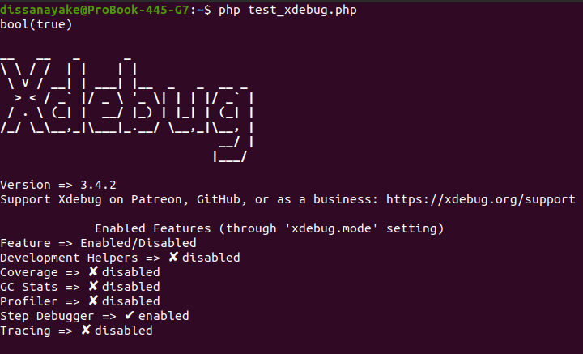

# Setup xdebug in ubuntu with VS-Code

## Identify Your PHP Versions

```bash
ls /etc/php/

# Check version
php -v
which php
```

If you need to switch between PHP versions,
Make sure to install and configure Xdebug for each version you plan to use.

## Install Xdebug for Your PHP Version

```bash
sudo apt update
sudo apt install php8.2-xdebug
```

## Configure Xdebug

```bash
sudo nano /etc/php/8.2/mods-available/xdebug.ini
```

add these lines

```bash
zend_extension=xdebug.so
xdebug.mode=debug
xdebug.start_with_request=yes
xdebug.client_host=127.0.0.1
xdebug.client_port=9003
xdebug.log=/tmp/xdebug.log
xdebug.idekey=VSCODE
```

## Verify Xdebug Installation

```bash
php -m | grep xdebug

php -r "phpinfo();" | grep xdebug
```

## Test Xdebug

```bash 
php -m | grep -i xdebug
```

## Test Xdebug Functionality

```bash
echo '<?php var_dump(extension_loaded("xdebug")); xdebug_info(); ?>' > test_xdebug.php
php test_xdebug.php
```

- You should see bool(true) and Xdebug configuration information without any "already loaded" warnings.

 

## Troubleshooting

```bash
tail -f /tmp/xdebug.log
```

## Check if there are conflicting xdebug entries

```bash
grep -r "xdebug" /etc/php/
```

## Restart server

```bash
# for apache2
sudo systemctl restart apache2

# for Nginx
sudo systemctl restart nginx
```

- If everything is set up correctly, Xdebug should be working by now.

## Laravel-Specific Xdebug Configuration

### Update Xdebug Configuration for Web Debugging

```bash
sudo nano /etc/php/8.2/mods-available/xdebug.ini

#add these lines
zend_extension=xdebug
xdebug.mode=debug,develop
xdebug.start_with_request=yes
xdebug.client_host=127.0.0.1
xdebug.client_port=9003
xdebug.log=/tmp/xdebug.log
xdebug.idekey=VSCODE
xdebug.max_nesting_level=512
xdebug.var_display_max_depth=10
xdebug.var_display_max_children=256
xdebug.var_display_max_data=1024

#restart apache server
sudo systemctl restart apache2
```

## VS Code Configuration for Laravel

- install xdebug vs-code extension/s 
- Create `.vscode/launch.json` in your Laravel root directory,
- **NOTE:** pathMappings in `.vscode/launch.json`
- After setting up just click (FN+F5)

## for PHP artisan serve

```json
{
    "version": "0.2.0",
    "configurations": [
        {
            "name": "Listen for Xdebug (Laravel Serve)",
            "type": "php",
            "request": "launch",
            "port": 9003,
            "pathMappings": {
                "/path/to/application": "${workspaceFolder}"
            },
            "ignore": [
                "**/vendor/**/*.php"
            ]
        },
        {
            "name": "Debug Laravel Serve with Xdebug",
            "type": "php",
            "request": "launch",
            "program": "${workspaceFolder}/artisan",
            "args": ["serve", "--host=127.0.0.1", "--port=8000"],
            "cwd": "${workspaceFolder}",
            "runtimeArgs": [
                "-dxdebug.mode=debug",
                "-dxdebug.client_host=127.0.0.1",
                "-dxdebug.client_port=9003",
                "-dxdebug.start_with_request=yes"
            ],
            "env": {
                "XDEBUG_CONFIG": "idekey=VSCODE"
            },
            "ignore": [
                "**/vendor/**/*.php"
            ]
        }
    ]
}
```

## Enable Xdebug for CLI and Web

```bash
#Enable for CLI (for artisan commands):
sudo phpenmod -s cli xdebug

#Enable for Apache/Nginx:
sudo phpenmod -s apache2 xdebug

# or for nginx with php-fpm
sudo phpenmod -s fpm xdebug

```

## Restart Services

```bash
# For Apache:
sudo systemctl restart apache2

# For Nginx with PHP-FPM:
sudo systemctl restart php8.1-fpm 
sudo systemctl restart nginx

```